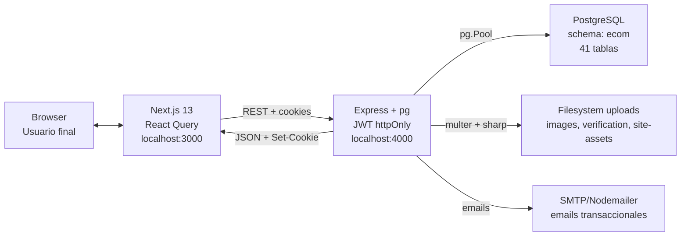
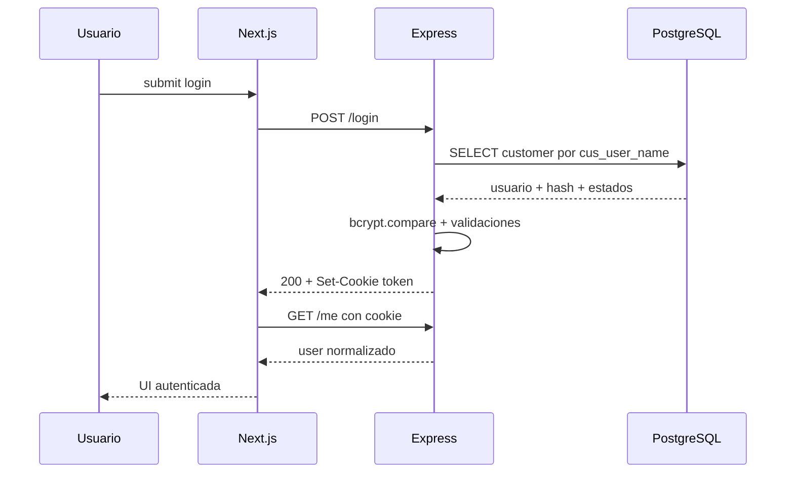
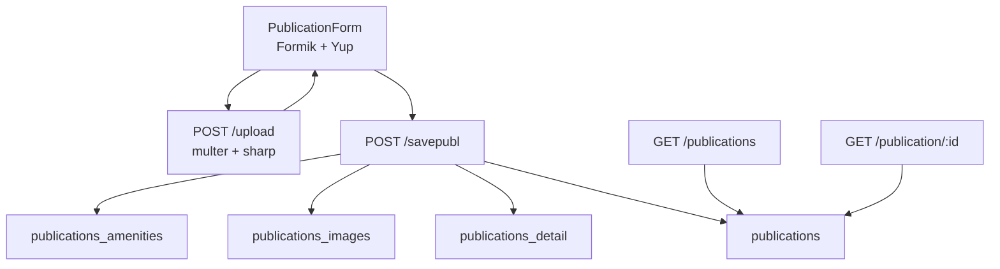
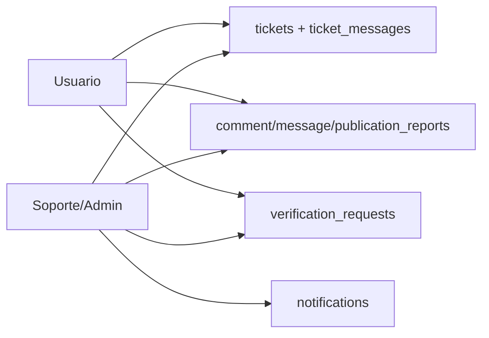

# Architecture — KIOSQUI

Documento cross-repo de arquitectura. Fuente de verdad histórica: [`../MIGRATION.md`](../MIGRATION.md).

Repos:

- Frontend: [ecommerceGT-Next](https://github.com/joseaurelioporrasbucaro-prog/ecommerceGT-Next)
- Backend: [ecommerceGTBackEnd](https://github.com/techmindsgt/ecommerceGTBackEnd)

## Vista top-level

## Capas

### Browser

El usuario navega la app Next.js. La sesión vive en una cookie httpOnly emitida por el backend; JavaScript del frontend no lee el JWT.

### Frontend — `ecommerceGT-Next`

Responsabilidades:

- Render de UI con Next.js App Router.
- Estado de servidor con React Query.
- Estado de usuario con `AuthContext` + `/me`.
- Protección inicial de rutas privadas con `src/middleware.ts`.
- Normalización visual de datos crudos del backend.
- SEO público: metadata, sitemap, robots, JSON-LD en publicaciones.

No debe:

- Guardar secrets.
- Leer o validar el JWT.
- Inventar permisos solo en cliente.
- Clonar componentes MUI del legacy.

### API client — `ApiFetch`

`src/utils/Api.ts` envuelve `fetch`:

- `credentials: 'include'` para mandar cookie httpOnly.
- Soporta JSON y `FormData`.
- Lanza `ApiError` con `status`, `message` y `body`.
- Devuelve `unknown` por default; call sites deben pasar genérico.

### Backend — `ecommerceGTBackEnd`

Responsabilidades:

- API REST Express.
- Autenticación JWT por cookie httpOnly.
- Autorización real en endpoints (`authMiddleware`, `requireSupport`).
- Queries PostgreSQL en `config/connPostgresDB.js`.
- Procesamiento de uploads con multer + sharp.
- Emails transaccionales con Nodemailer.
- Servir `/uploads` públicos, excepto documentos sensibles de verificación.

Puntos importantes:

- CommonJS, no ES modules.
- `server.js` expone 128 rutas.
- `connPostgresDB.js` concentra la lógica de negocio.
- Cambios de migración en backend se marcan con `// Codigo Aurelio`.

### Base de datos — PostgreSQL

Schema lógico: `ecom`.

Tablas principales:

- Cuenta y auth: `customer`, `customer_audit_log`, `cat_password_status`.
- Marketplace: `publications`, `publications_detail`, `publications_images`, `publications_favorites`.
- Social: `publications_comments`, `comment_likes`, `customer_follows`, `seller_ratings`.
- Mensajería/notificaciones: `messages`, `message_reactions`, `notifications`.
- Soporte: `verification_requests`, `publication_reports`, `tickets`, `ticket_messages`.
- Pauta/pagos/admin: `ad_campaigns`, `platform_config`, `customer_payment_methods`, `site_assets`.

Ver detalle en [Backend SCHEMA.md](https://github.com/techmindsgt/ecommerceGTBackEnd/blob/master/docs/SCHEMA.md).

## Flujo de sesión

Estados especiales:

- `passta_id=2` bloquea por intentos fallidos y puede requerir reset.
- `cus_account_status=suspended/banned/deleted` bloquea login normal.
- `inactive` y `pending_deletion` pueden reactivarse por login si están dentro de reglas de gracia.

## Flujo de publicación

## Flujo de soporte

Soporte real se valida en backend con `requireSupport`. El frontend solo oculta/enseña navegación según `user.role`.

## Uploads y privacidad

| Carpeta | Acceso | Uso |
| --- | --- | --- |
| `uploads/images` | Público por `/uploads` | Fotos de publicaciones, avatar, cover. |
| `uploads/site-assets` | Público por `/uploads` | CMS-lite de imágenes del sitio. |
| `uploads/verification` | Bloqueado por `app.use("/uploads/verification", 403)` | DPI/RTU. Solo soporte descarga vía endpoint autenticado. |

## Ambientes

| Capa | Local | Producción |
| --- | --- | --- |
| Frontend | `http://localhost:3000` | Vercel |
| Backend | `http://localhost:4000` | Render |
| DB | PostgreSQL local | Render Postgres / instancia administrada |
| Emails | SMTP configurado en `.env` | SMTP configurado en dashboard |

## Principios de arquitectura

- Fuente de verdad de fases: `MIGRATION.md`.
- Fuente de verdad del schema: `database.sql`.
- Fuente de verdad de API: `ecommerceGTBackEnd/docs/API_REFERENCE.md`.
- Frontend consume datos vía hooks React Query, no `fetch` sueltos en componentes.
- Backend autoriza; frontend solo mejora UX.
- Nuevas queries y tablas deben usar `ecom.` explícito.
- Si el shape no se puede comprobar en código, se documenta como TODO en lugar de inventarlo.

## Riesgos conocidos

- El backend sigue concentrado en un archivo grande; no refactorizar sin fase.
- Algunos endpoints legacy aún carecen de auth suficiente; están marcados como TODO en API Reference.
- Sesión JWT dura 1h sin refresh token.
- CORS/cookies requieren ajuste si frontend/backend viven en dominios distintos.
- Pauta todavía usa stub de pasarela; métodos de pago no cobran dinero real.
- i18n completo pendiente de Fase 14.
